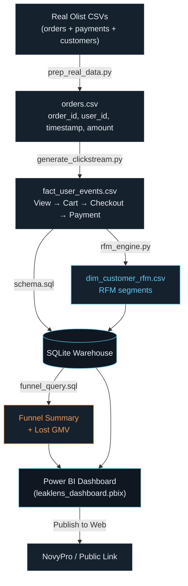

# E-Commerce Conversion Funnel & RFM Engine

Sessionizes user behavior, quantifies multi-stage conversion leakage, segments
customers via RFM, and surfaces Lost GMV — end to end, Python → SQL → Power BI.

## Architecture



## Quick start

```bash
pip install -r requirements.txt
python src/run_pipeline.py
```

This generates synthetic demo data, builds the clickstream layer, loads a
local SQLite warehouse at `data/processed/warehouse.db`, runs the validated
funnel query, and prints RFM segment counts — no external dataset required
to see the pipeline work.

## Real-data results

Run against the real Olist dataset (99,440 orders, 96,095 unique
customers), the pipeline produces:

| Metric | Value |
|---|---|
| Total sessions | 331,467 |
| Total events | 854,293 |
| Session conversion rate | 30% (simulation parameter — see note below) |
| Lost cart GMV | ₹21.05 crore |
| Purchasing customers (RFM-scored) | 67,357 |
| Champions | 5 |
| Loyal Customers | 86 |
| At Risk | 17 |
| Need Attention | 13,964 |
| New Buyers | 26,387 |
| Hibernating | 26,898 |

**Which of these numbers are "real" vs simulated, honestly:** the 30%
conversion rate is not a finding — it's a direct consequence of the
`abandonment_rate=0.70` parameter set in `generate_clickstream.py` (see
"Data provenance" below), so it will read as ~30% on any input data by
construction. What *is* genuinely data-driven: the RFM segment skew
heavily toward Hibernating/New Buyers rather than Champions/Loyal, which
reflects a real, well-documented characteristic of the Olist dataset —
the overwhelming majority of Olist customers make exactly one purchase
and never return. Lost GMV and session counts scale directly with the
real order data's actual size and value distribution.

## Using the real Olist dataset

1. Download `olist_orders_dataset.csv`, `olist_order_payments_dataset.csv`,
   and `olist_customers_dataset.csv` from
   [Kaggle: Brazilian E-Commerce Public Dataset by Olist](https://www.kaggle.com/datasets/olistbr/brazilian-ecommerce).
2. Copy all three into `data/raw/`.
3. Run `python src/prep_real_data.py` — this joins the three files into the
   single `order_id, user_id, order_timestamp, transaction_amount_inr` shape
   `run_pipeline.py` expects, using `customer_unique_id` (not `customer_id`)
   as the person-level identifier so repeat customers are correctly linked
   across orders (Olist's `customer_id` is unique per-order, not per-person
   — see `src/prep_real_data.py`'s docstring).
4. It writes `data/raw/olist_orders_dataset.prepped.csv` — rename that file
   to exactly `olist_orders_dataset.csv`, replacing the raw file.
5. Re-run `python src/run_pipeline.py` — it auto-detects the prepped file,
   converts BRL → INR (documented rate, see `run_pipeline.py`), and uses it
   instead of the synthetic generator.

### Currency conversion (BRL → INR)

Olist's `payment_value` field is Brazilian Real, not Indian Rupees. Naming a
column `transaction_amount_inr` without converting it would mean presenting
BRL figures as rupees — a mistake that falls apart the moment anyone checks.
`run_pipeline.py` converts using a documented mid-market rate (checked
against ECB/exchangerate-api data), stored as a constant you can update
before a real run. The original BRL value is preserved alongside the
converted one so the conversion is auditable, not silent.

### Why Olist, not an Indian dataset

No free, public, order-level Indian e-commerce dataset exists — Flipkart,
Myntra, and Amazon India's transaction data is proprietary. Olist is the
de facto global standard stand-in for this kind of relational e-commerce
analysis (orders + items + payments + customers, all joinable) precisely
*because* local alternatives usually don't exist publicly — this is a
documented pattern in the analytics community, not unique to India (e.g. a
published Indonesian RFM thesis used Olist for the same reason when
Tokopedia-equivalent data wasn't available).

What *is* India-calibrated: the funnel abandonment rates in
`generate_clickstream.py` are tuned to published Indian cart-abandonment
benchmarks (70–75% overall, higher on mobile), and all monetary values are
converted to INR. So the order-level rows are Brazilian, but the funnel
behavior model and currency are not — and that's exactly how to frame it if
asked.

## Data provenance — read this before writing resume numbers

Olist is an **order-level** dataset. It has no raw clickstream (no Product
View / Add to Cart / Checkout events) — nobody's public e-commerce dataset
does, because that data is proprietary. `generate_clickstream.py` builds a
realistic pre-purchase funnel on top of real completed orders, calibrated to
published cart-abandonment benchmarks (65–75%), and clearly documents this
as simulated in its own docstring.

**Be upfront about this in interviews and the README you publish**: "I built
the funnel simulation layer on top of real Olist order data, since public
e-commerce datasets don't expose raw clickstream" is a *stronger* answer than
letting anyone assume the events are real — it shows you understand the data
gap, not just the code. Don't publish specific Lost-GMV / conversion-rate
numbers from a run as if they're empirical findings; frame them as "on
simulated funnel data calibrated to industry abandonment benchmarks."

## Validation notes (why the code looks like this)

- **RFM (`rfm_engine.py`)** — Frequency uses explicit `pd.cut()` thresholds,
  not `pd.qcut()`. `pd.qcut()` throws `ValueError: Bin edges must be unique`
  when 80%+ of buyers are single-purchase (confirmed against
  `pandas-dev/pandas` issue #7751). `duplicates='drop'` isn't used instead
  because it silently shrinks the bin count, which breaks a fixed
  `labels=[1,2,3,4,5]` array the moment edges collide (issue #22669).
  Recency and Monetary use a `safe_quantile_score()` helper instead, which
  cannot crash even on zero-variance data (see `src/GAP_AUDIT_RFM.md`).
- **Funnel (`sql/funnel_query.sql`)** — uses session-flag conditional
  aggregation (`MAX(CASE WHEN...)` per `session_id`), not `LEAD()`. `LEAD()`
  only inspects the immediate next row, so a session that loops
  (View → Cart → View → Checkout) gets falsely flagged as an abandonment.
  This is a documented SQL funnel-analysis failure mode; conditional
  aggregation is the standard fix. `generate_clickstream.py` deliberately
  injects these loops (~35% of completed sessions) so the fix is actually
  exercised, not just theoretical. See `sql/GAP_AUDIT.md`.
- **DAX (`dax/measures.dax`)** — conversion rate uses
  `DISTINCTCOUNT(session_id)`, not raw event count (raw counts undercount —
  40 product views before 1 purchase should read as 100% conversion for that
  session, not 2.5%). Lost GMV dedupes per session via `MAX`, not `SUMX`
  over every checkout attempt (which multiplies Lost GMV on payment
  retries), and qualifies on "Add to Cart" (not "Checkout Initiated") to
  match the SQL query's broader definition of cart abandonment — an earlier
  mismatch between the two was caught mid-build (see project bug log).

## What's deliberately NOT in this build

Fulfillment SLA tracking, UTM channel attribution, and automated
email/SMS/WhatsApp recovery webhooks were scoped out — they need real
production data and infrastructure a solo portfolio project doesn't have,
and risk inviting "is this data even real?" questions in an interview. The
gap-audit story above is the differentiator to lead with, not dashboard
polish.

## Repo layout

```
src/
  sample_data.py           synthetic order generator (demo fallback)
  generate_clickstream.py  builds the simulated funnel event layer
  rfm_engine.py             validated RFM scoring + segmentation
  prep_real_data.py         joins real Olist orders+payments+customers CSVs
  run_pipeline.py            one-command end-to-end runner
  GAP_AUDIT_RFM.md           RFM qcut-crash gap audit writeup
  PIPELINE_NOTES.md          pipeline architecture notes
sql/
  schema.sql                star schema DDL
  funnel_query.sql           validated session-flag funnel query
  GAP_AUDIT.md               SQL LEAD() gap audit writeup
dax/
  measures.dax               Power BI measures
  leaklens-theme.json        Power BI custom theme (Executive Dark)
data/
  raw/                        put real Olist CSVs here
  processed/                  pipeline output (fact_user_events.csv, warehouse.db, RFM table)
leaklens_dashboard.pbix       the built Power BI report
```
