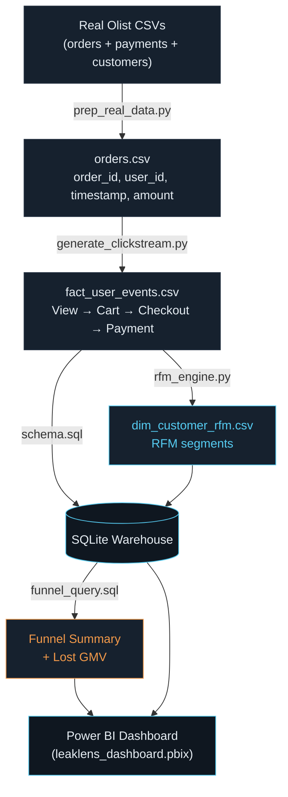

# LeakLens

**E-Commerce Conversion Funnel & RFM Engine**

An end-to-end analytics pipeline that sessionizes e-commerce user behavior,
quantifies conversion loss at each stage of the purchase funnel, and
segments customers by purchasing behavior using RFM (Recency, Frequency,
Monetary) analysis. Built across Python, SQL, and Power BI.

## What it does

- Models the customer journey as a four-stage funnel: Product View → Add to
  Cart → Checkout Initiated → Payment Completed
- Computes session-level conversion rate and Lost GMV (the monetary value of
  carts that were never converted to a completed order)
- Segments customers into six behavioral groups (Champions, Loyal Customers,
  New Buyers, Need Attention, At Risk, Hibernating) using RFM scoring
- Presents the results in an interactive Power BI dashboard

## Architecture



## How it's built

**Data layer.** `prep_real_data.py` joins Olist's orders, payments, and
customers tables into a single order-level dataset, using
`customer_unique_id` to correctly identify repeat customers across orders
(Olist's `customer_id` is assigned per order, not per person).

**Behavioral layer.** `generate_clickstream.py` builds session-level
clickstream events on top of each order — every completed order becomes a
full-funnel session, and additional abandoned sessions are added at each
drop-off stage, calibrated to published cart-abandonment benchmarks.
Roughly a third of completed sessions include a non-linear browsing loop
(returning to product view after adding to cart), so the funnel logic is
tested against realistic, non-sequential user behavior rather than a
clean linear path.

**Warehouse layer.** `schema.sql` defines a lightweight SQLite warehouse.
`funnel_query.sql` computes the funnel summary and Lost GMV using
session-level conditional aggregation. `rfm_engine.py` scores every
purchasing customer on Recency, Frequency, and Monetary value and assigns
a segment.

**Presentation layer.** `leaklens_dashboard.pbix` connects to the warehouse
output and renders the funnel, RFM segments, and headline KPIs, using a
custom Power BI theme (`dax/leaklens-theme.json`).

`run_pipeline.py` runs all of the above end to end with a single command.

## Tech stack

Python (pandas, NumPy) · SQL (SQLite) · Power BI (DAX, custom theming)

## Quick start

```bash
pip install -r requirements.txt
python src/run_pipeline.py
```

This runs the pipeline on synthetic demo data, producing a working SQLite
warehouse and RFM table without requiring any external dataset.

## Using the real Olist dataset

1. Download `olist_orders_dataset.csv`, `olist_order_payments_dataset.csv`,
   and `olist_customers_dataset.csv` from
   [Kaggle: Brazilian E-Commerce Public Dataset by Olist](https://www.kaggle.com/datasets/olistbr/brazilian-ecommerce).
2. Copy all three into `data/raw/`.
3. Run `python src/prep_real_data.py`, which joins the three files into the
   shape `run_pipeline.py` expects.
4. Rename the resulting `data/raw/olist_orders_dataset.prepped.csv` to
   `olist_orders_dataset.csv`, replacing the raw file.
5. Run `python src/run_pipeline.py` — it detects the prepared file
   automatically and converts payment values from BRL to INR (see
   `run_pipeline.py` for the documented exchange rate).

## Results on the real dataset

Run against the full Olist dataset (99,440 orders, 96,095 unique
customers):

| Metric | Value |
|---|---|
| Total sessions | 331,467 |
| Total events | 854,293 |
| Session conversion rate | 30% |
| Lost cart GMV | ₹21.05 crore |
| Purchasing customers (RFM-scored) | 67,357 |
| Champions | 5 |
| Loyal Customers | 86 |
| At Risk | 17 |
| Need Attention | 13,964 |
| New Buyers | 26,387 |
| Hibernating | 26,898 |

The RFM segment distribution — heavily weighted toward Hibernating and New
Buyers rather than Champions and Loyal Customers — reflects a well-documented
characteristic of the Olist dataset: the large majority of customers make a
single purchase and do not return.

## Why the Olist (Brazilian) dataset

No free, public, order-level Indian e-commerce dataset exists — platform
transaction data from Flipkart, Myntra, and Amazon India is proprietary.
Olist's dataset is a widely used stand-in for this kind of relational
e-commerce analysis (orders, items, payments, and customers, all joinable)
precisely because comparable local datasets are rarely available publicly;
this is a common pattern across markets, not specific to India.

The funnel abandonment rates in this project are calibrated to published
Indian e-commerce benchmarks (70-75% overall, higher on mobile), and all
monetary values are converted to INR. The order-level transaction data
originates from Brazil; the behavioral model and currency do not.

## Methodology

Funnel behavior (Product View, Add to Cart, Checkout Initiated, Payment
Completed) is generated on top of real Olist order data, since public
order-level e-commerce datasets do not expose raw clickstream events. This
layer models realistic pre-purchase behavior around real completed
transactions. RFM segmentation and Lost GMV figures are computed directly
from the combined dataset.

## Design decisions

- **RFM scoring (`rfm_engine.py`)** uses explicit threshold-based binning
  for Frequency rather than quantile-based binning, which fails when a
  large share of customers have made exactly one purchase (a common
  distribution in e-commerce data). Recency and Monetary scoring use a
  rank-based quantile method that produces a valid score regardless of how
  skewed or tied the underlying values are.
- **Funnel computation (`funnel_query.sql`)** uses session-level conditional
  aggregation rather than sequential row comparison, so that sessions with
  non-linear browsing (returning to product view before completing
  checkout) are still correctly attributed to their furthest completed
  stage.
- **DAX measures (`dax/measures.dax`)** compute conversion rate as a
  distinct count of sessions rather than a raw event count, and compute
  Lost GMV as a per-session maximum rather than a sum across all events, to
  avoid inflating the metric when a session contains multiple related
  events.

## Out of scope

Fulfillment SLA tracking, marketing channel attribution, and automated
cart-recovery messaging were scoped out — they require production data and
infrastructure outside what this project's data sources provide.

## Repository structure

```
src/
  sample_data.py            synthetic order generator (demo mode)
  generate_clickstream.py   builds the funnel event layer
  rfm_engine.py              RFM scoring and segmentation
  prep_real_data.py          joins real Olist orders, payments, customers
  run_pipeline.py             end-to-end pipeline runner
sql/
  schema.sql                 warehouse schema
  funnel_query.sql            funnel and Lost GMV query
dax/
  measures.dax                Power BI measures
  leaklens-theme.json         Power BI custom theme
data/
  raw/                         source CSVs
  processed/                   pipeline output
leaklens_dashboard.pbix        Power BI report
```
